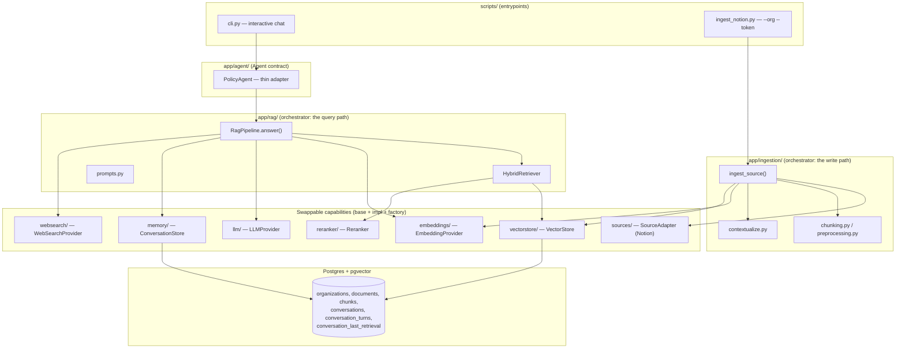
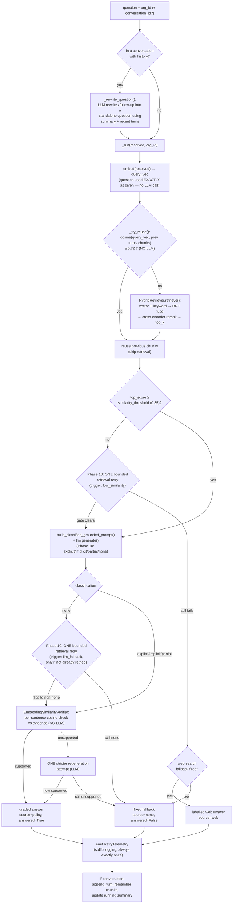

# ARCHITECTURE.md — Complete Technical Reference

> **Purpose of this file.** A single, end-to-end description of what this project
> is, how every component works, and how data flows through it — enough for a
> human or an AI agent to gain full context without reading the whole codebase
> first. It complements two sibling docs:
> - **CLAUDE.md** — the *decision log* (why each choice was made, phase by phase, plus gotchas).
> - **README.md** — the *user-facing quickstart* per phase.
>
> This file is the *system reference*. When code and this file disagree, the code wins — keep this updated.

---

## 1. What this system is

A **multi-tenant Retrieval-Augmented Generation (RAG) platform for company policy Q&A.**

- **Tenants (organizations)** upload their policy documents (currently via **Notion**).
- Their **employees ask natural-language questions** and get answers **grounded in that organization's own policies**, with citations.
- **Strict tenant isolation:** one organization can never see another's content.
- **Eventual goal:** a **self-hosted Docker image** an enterprise runs inside its own infrastructure — so the design favors components that run **locally, free, with no external paid dependency** (local embeddings, local reranker, keyless web search, a swappable LLM endpoint).

**Why RAG, not fine-tuning:** policies are *facts that change* (leave rules, reimbursement limits). RAG retrieves the current document text at question time, so updating a policy is just re-ingesting a file — no retraining, and answers cite sources.

---

## 2. Core design principles

1. **Everything is a swappable interface + factory.** Each capability has `base.py` (abstract contract) + one or more concrete impls + `factory.py` (`build_*()` reads config, returns the impl). The rest of the app depends on the *interface*, never a concrete class.
2. **Orchestrators have no `base.py`.** A package that only *composes* existing interfaces (e.g. `app/rag/`, `app/ingestion/`) skips the abstract contract — there's nothing to swap. It still keeps `pipeline.py` + `factory.py` for consistency. Exception: `app/agent/` *does* get a `base.py` because a second backend (a GitHub agent) is genuinely planned.
3. **Config lives in exactly one place.** `app/config/settings.py` — frozen dataclasses with `from_env()`. Nothing else calls `os.getenv` for config.
4. **All failures raise `ProviderError`** (or a subclass in `app/core/exceptions.py`), carrying the original via `cause=` / `raise ... from`.
5. **Tenant isolation is enforced by the query, not the index.** Every tenant-scoped read/write requires an `org_id`; retrieval filters `WHERE org_id = …` *before* ranking.
6. **Grounding is enforced by two independent layers** (a cheap confidence gate + a strict prompt), never one.
7. **Dependency-light.** Thin official SDKs over frameworks (plain `openai` client not LiteLLM; `notion-client` not `llama-index`). Presentation-only deps (`rich`) are confined to `scripts/` and never imported by `app/`.

---

## 3. Tech stack

| Concern | Choice | Notes |
|---|---|---|
| Language | Python 3.12 | `from __future__ import annotations`, type hints throughout |
| LLM | Any **OpenAI-compatible** endpoint via the `openai` client | Config-swappable: `LLM_MODEL` + `LLM_BASE_URL` + `LLM_API_KEY`. Dev uses FreeLLMAPI at `localhost:3001`. |
| Embeddings | **BGE-M3** (1024-dim) via `sentence-transformers`, in-process | `local` backend ($0, offline); a `remote` HTTP backend exists behind the same interface |
| Vector DB | **Postgres + pgvector** (`pgvector/pgvector:pg17` via docker-compose) | HNSW cosine index; connection pooling |
| Reranker | **`BAAI/bge-reranker-v2-m3`** cross-encoder, in-process | via `sentence-transformers` CrossEncoder |
| Source | **Notion** via official `notion-client` SDK | one `SourceAdapter` interface; Drive/GitHub/Slack later |
| Web search | **DuckDuckGo** via `ddgs` (keyless) | Tavily is the documented production swap |
| CLI UI | **`rich`** | presentation only, confined to `scripts/cli.py` |
| Tests/eval | `pytest` + optional **RAGAS** (`[eval]` extra) | |

---

## 4. High-level architecture



There are **two end-to-end flows**: the **write path** (ingestion) and the **read path** (query). Everything else is a capability those two paths compose.

---

## 5. END-TO-END FLOW A — Ingestion (the write path)

**Entrypoint:** `scripts/ingest_notion.py --org "Acme Corp" --token acme`
**Orchestrator:** `app/ingestion/pipeline.py::ingest_source(adapter, org_id, …)`

Step by step:

1. **Resolve credential (per-org).** `build_source_adapter("notion", token_name="acme")` →
   `NotionSettings.resolve_token("acme")` returns *only* the `NOTION_TOKEN_ACME` secret
   (raises if missing; **never** falls back to another org's token or the global `NOTION_TOKEN`).
2. **Create the org.** `store.create_organization(name)` → returns a new `org_id` (UUID).
3. **Apply schema** (idempotent) via `apply_schema()`.
4. **List documents.** `adapter.list_documents()` → Notion `search` returns only pages **shared with that integration** (access enforced by Notion, not our code). Returns `SourceRef` (metadata only — cheap).
5. **For each document:**
   a. `adapter.fetch_document(id)` → converts the Notion block tree to Markdown-ish plain text *inside the adapter* (`_render_block`: headings→`#`, bullets→`-`, tables→`|`-rows; `child_page` blocks are separate documents, not inlined).
   b. `preprocess(text)` → clean text.
   c. `chunk_text(clean, chunking)` → paragraph-aware chunks (default ~1000 chars, 150 overlap).
   d. **Contextual retrieval (Phase 6, default on):** `contextualize_chunks(llm, clean, chunks)` prepends a short **LLM-generated context** to each chunk (one LLM call per chunk, *at ingest only*). Stored `content` becomes `"<context>\n\n<original chunk>"`, so the situating meaning enters both the vector and the keyword index. Best-effort (falls back to the raw chunk on LLM error).
   e. `embedder.embed(chunks)` → 1024-dim BGE-M3 vectors.
   f. `store.add_document(org_id, title, chunks, embeddings, source_uri)` → inserts a `documents` row + `chunks` rows (each stamped with `org_id`).
6. **Result:** `IngestResult(documents_ingested, chunks_stored, documents_skipped, document_ids)`. Empty pages (no text — e.g. a parent/index page) are counted as *skipped*, not stored.

> **Cost note:** contextual retrieval makes one LLM call per chunk, so ingestion needs the LLM endpoint up. Disable with `INGEST_CONTEXTUAL_ENABLED=false` to only embed+store.

---

## 6. END-TO-END FLOW B — Query (the read path)

**Entrypoint:** `scripts/cli.py <org_id>` → `PolicyAgent.answer(question, org_id, conversation_id)`
**Orchestrator:** `app/rag/pipeline.py::RagPipeline.answer()`

`PolicyAgent` is a **thin adapter**: it calls `RagPipeline.answer()` and maps the `RagResult` → `AgentResponse` (chunks → `Citation`s). It adds *no* logic.

### 6.1 The full sequence (`RagPipeline.answer`)



### 6.2 The steps in words

1. **Query rewrite (memory, Phase 5) — only in a conversation with prior turns.**
   `_rewrite_question()` makes one cheap LLM call turning a context-dependent
   follow-up ("what about part-timers?") into a standalone question, using the
   running **summary** + the last `MEMORY_RECENT_TURNS` (=3) turns verbatim. Guarded:
   if the rewrite doesn't look like a single question, it falls back to the original.
   The rewritten question is exposed as `RagResult.resolved_question`.

2. **First retrieval attempt (unchanged from pre-Phase-10 behavior) — zero extra
   cost.** `_run()` embeds the (resolved) question **exactly as given** — no
   normalization, no LLM call — a single time; the same `query_vec` is used for
   both the reuse check and (if needed) vector search. Most questions succeed here
   without ever touching Phase 10's retry machinery.

3. **Retrieval reuse (Phase 8) — a deterministic, NON-LLM gate before retrieval.**
   `_try_reuse()` recomputes embeddings for the *previous turn's* chunks (stored as
   text in `conversation_last_retrieval`) and compares by plain cosine. If the best
   similarity ≥ `RETRIEVAL_REUSE_THRESHOLD` (**0.72**), those chunks are reused and
   retrieval is skipped. The reuse similarity becomes `top_score`, so reused chunks
   flow through the **unchanged** gate below — reuse only saves work, never bypasses
   grounding. Org-scoped (never crosses tenants). Fires rarely by design (0.72 is
   deliberately conservative — see §11).

4. **Retrieval (Phase 6) — if not reused.** `HybridRetriever.retrieve()`:
   - **Vector search** over a wide `candidate_pool` (=30), org-scoped.
   - **Keyword search** (Postgres full-text, BM25-style `ts_rank` on a generated `content_tsv`).
   - **Reciprocal Rank Fusion (RRF, k=60)** merges the two rank lists (rank-based, so no score normalization needed).
   - **Cross-encoder rerank** the fused pool → final `top_k` (=5).
   - `gate_score` = **best cosine** among candidates (== the vector top-1 the gate always used). Hybrid/rerank only reorder; they never change the gate signal.

5. **Confidence gate (layer 1, Phase 3, UNCHANGED threshold logic).** If
   `top_score < similarity_threshold` (**0.35**), skip the LLM entirely and try
   the Phase 10 retry (step 6) before falling back — this is still the cheap
   first defense against answering from irrelevant context.

6. **Bounded retrieval retry — trigger 1: low similarity (Phase 10,
   `RagPipeline._attempt_retrieval_retry`).** Fires only when step 5's gate
   fails. ONE LLM call (`QueryUnderstander`, `app/rag/query_understanding.py`)
   proposes up to 2 alternate phrasings for retrieval only — never answers,
   never invents facts, and (after a caught design flaw) never silently
   generalizes away a specific named term in the question. Retrieval re-runs
   including the **original question plus those alternates**
   (`HybridRetriever.retrieve_expanded`, reusing the same RRF fusion — it
   already generalizes to N ranked lists). If the retry still doesn't clear the
   gate, the pipeline falls back (through the unchanged Phase 5 web-search path
   first). **Capped at exactly one retry, ever, never recursive** — proven (not
   just asserted) to never regress the pre-retry score, since the original
   query's own top-1 candidate is always re-included in the fused pool.

7. **Evidence classification + graded generation (layer 2, Phase 10,
   `build_classified_grounded_prompt`) — replaces the old binary
   answer-or-refuse prompt.** ONE LLM call classifies how well the evidence
   supports the question — `explicit` (states it directly), `implicit` (doesn't
   state it but clearly implies it — the answer must say so explicitly,
   distinguishing inference from stated fact), `partial` (answers part, states
   what's missing, never guesses), or `none` (genuinely unrelated — the *same*
   bar the old prompt's refusal condition used) — and drafts a
   style-appropriate answer in the same call. Same cost as the prompt it
   replaces (one LLM call either way).

8. **Bounded retrieval retry — trigger 2: classification still "none" despite a
   passing gate (Phase 10).** A guardrail for what cosine similarity alone
   can't reveal: a chunk that "looks" related enough to clear 0.35 but isn't
   the *right* chunk. Only fires if trigger 1 didn't already use the single
   retry budget this call. If the retry's re-classification is still `"none"`,
   the pipeline returns the original fallback unchanged.

9. **Deterministic answer verification (Phase 10, `app/verification/`) — every
   non-`"none"` classification passes through this before reaching the user.**
   `EmbeddingSimilarityVerifier` splits the drafted answer into sentences
   (skipping markdown headings and honest hedge/meta-statements like "the
   policy does not explicitly state X") and checks each against the retrieved
   evidence by cosine similarity — **no LLM call, no new model**, reusing the
   already-loaded embedder. An unsupported sentence triggers **one** stricter
   regeneration attempt (shown the specific flagged sentences); if still
   unsupported, the pipeline falls back rather than let an ungrounded claim
   through.

10. **Web-search fallback (Phase 5) — only when the gate (and its Phase 10
    retry) both fail.** `_gate_failed()` → `_try_web_search()`:
    - One LLM **decision call** offering a `web_search` *tool* (real function-calling). The tool description says: call it ONLY for real, named, *external* entities (an insurer/product/company); do NOT call it for internal company info.
    - If the model calls it: exactly **one bounded search** runs (DuckDuckGo), results are fed back, one answer call composes the reply.
    - The answer is prefixed with an unmistakable banner (`WEB_ANSWER_LABEL`) and `source="web"`, `answered=True`.
    - Any failure/timeout/empty/decline → the fixed internal fallback (`source="none"`, `answered=False`).

11. **Retry telemetry (Phase 10, `app/core/telemetry.py`) — always emitted,
    exactly once per `_run()` call.** A `RetryTelemetry` record (trigger,
    generated queries, success, latency, scores before/after, final source) is
    logged via stdlib `logging` (no new dependency) regardless of whether a
    retry fired — so production logs can answer "how often does the retry
    engage, and does it help" from the denominator of all traffic, not just
    retry events. Purely observational; cannot affect any decision above.

12. **Persist conversation state (Phase 5/8) — only in a conversation.**
   `append_turn()` stores the Q+A; `_remember_retrieval()` saves this turn's chunks
   (text + locator, no embeddings) for the next reuse check; `_update_running_summary()`
   incrementally folds the single turn that just left the verbatim window into the
   running summary (one LLM call over `summary + one turn`, ~constant cost).

### 6.3 The result object

`RagResult(answer, answered, source, sources, top_score, resolved_question, retrieval_reused, evidence_classification)`
→ mapped by `PolicyAgent` to
`AgentResponse(answer, grounded, source, citations, resolved_question, top_score, retrieval_reused, evidence_classification)`.

- **`source`** is the branch signal: `"policy"` | `"web"` | `"none"`. Unchanged by
  Phase 10 — all three answered classifications (explicit/implicit/partial) still
  map to `source="policy"`, so nothing downstream that branches on `source` needed
  to change.
- **`answered`/`grounded`** is `True` for policy AND web answers; `False` only for the fixed fallback. **Branch on the bool / `source`, never on string-matching the answer.**
- **`evidence_classification`** (Phase 10) — `"explicit"|"implicit"|"partial"|"none"|None` (the last when the gate/retry short-circuited before classification ran) — an orthogonal diagnostic, not a new branch signal.

---

## 7. Component reference (`app/`)

| Package | Contract (`base.py`) | Concrete impl(s) | Responsibility |
|---|---|---|---|
| `config/` | — | `settings.py` | Typed frozen dataclasses w/ `from_env()`. **Only** place reading env for config. |
| `core/` | — | `exceptions.py`, `telemetry.py` | `ProviderError` hierarchy (`LLMProviderError`, `EmbeddingError`, `ConfigurationError`, `SourceError`, `WebSearchError`, `DatabaseError`). `telemetry.py` (P10): `RetryTelemetry` — stdlib `logging` only, no new dependency. |
| `llm/` | `LLMProvider` | `OpenAICompatProvider` | `generate(prompt)` and optional `generate_with_tools(messages, tools, tool_choice)` (function-calling; `NotImplementedError` by default). |
| `embeddings/` | `EmbeddingProvider` | `local.py` (sentence-transformers), `remote.py` (HTTP) | `embed(list[str]) -> list[list[float]]`. BGE-M3, 1024-dim, L2-normalized. |
| `db/` | — | `connection.py`, `schema.sql`, `migrate.py` | Pooled psycopg connections (`register_vector` in the pool's `configure` hook). `apply_schema()` uses a **direct** connection (migration must not use the pool). `close_pool()` at every process exit. |
| `vectorstore/` | `VectorStore` | `PgVectorStore` | `create_organization`, `add_document`, `query` (vector), `keyword_search` (optional), `list_organizations` (optional). All tenant-scoped reads require `org_id`. |
| `ingestion/` | — (orchestrator) | `pipeline.py`, `preprocessing.py`, `chunking.py`, `contextualize.py` | The write path (§5). |
| `rag/` | — (orchestrator) | `pipeline.py`, `retrieval.py`, `prompts.py`, `query_understanding.py`, `factory.py` | The read path (§6). `query_understanding.py` (P10): `QueryUnderstander` — retry-only, never runs unconditionally. |
| `reranker/` | `Reranker` | `local.py` (CrossEncoder) | `rerank(query, candidates, top_k)`. `bge-reranker-v2-m3` (~2.2 GB first download, then cached). |
| `verification/` | `Verifier` | `embedding_similarity.py` (`EmbeddingSimilarityVerifier`) | (P10) `verify(answer, evidence) -> VerificationResult`. Deterministic — per-sentence cosine similarity against evidence, reusing the loaded embedder. No LLM call, no new model. |
| `sources/` | `SourceAdapter` | `notion.py` | `list_documents` / `fetch_document` / `get_last_modified`. Format conversion lives *inside* the adapter. |
| `memory/` | `ConversationStore` | `pg_store.py` | Org-scoped conversation history: turns, running summary, last-retrieval. `get_context`, `append_turn`, `get_turns`, `get_summary`, `set_summary_and_prune`, `get_last_retrieval`, `set_last_retrieval`. |
| `websearch/` | `WebSearchProvider` | `duckduckgo.py` | `search(query, max_results, timeout) -> list[SearchResult]`. |
| `agent/` | `Agent` (+ `AgentResponse`, `Citation`) | `policy_agent.py` | The formal, source-agnostic Q&A contract. `PolicyAgent` is a thin adapter over `RagPipeline`. |

**Other top-level:**
- `evaluation/` — golden-set eval (deterministic path-firing tier + RAGAS tier). Peer to `scripts/`/`tests/`.
- `scripts/` — entrypoints: `cli.py`, `ingest_notion.py`, `verify_providers.py`, `init_db.py`, `demo_rag.py`, `compare_retrieval.py`, `demo_phase8.py`.
- `tests/` — pytest suite (isolation, grounding, conversation, websearch, retrieval, golden-set path-firing, incremental summary, reuse, CLI, notion credentials, query understanding, verification, vocabulary-mismatch end-to-end).

---

## 8. Database schema (`app/db/schema.sql`)

| Table | Responsibility | Key columns |
|---|---|---|
| `organizations` | Tenants; everything hangs off an org | `id` (uuid), `name`, `created_at` |
| `documents` | A source policy file/upload, scoped to one org | `id`, `org_id`, `title`, `source_uri`, `created_at` |
| `chunks` | Text chunks + embedding, scoped to one org | `id`, `org_id`, `document_id`, `chunk_index`, `content`, `embedding vector(1024)`, `content_tsv` (generated `tsvector`, GIN-indexed), `created_at` |
| `conversations` | A conversation, scoped to one org | `id`, `org_id`, `summary` (running compression), `created_at` |
| `conversation_turns` | One Q+A within a conversation | `id`, `conversation_id`, `org_id`, `turn_index`, `question`, `answer`, `created_at` |
| `conversation_last_retrieval` | Last turn's chunks for the reuse check | `conversation_id` (PK), `org_id`, `chunks` (JSON: `{content, document_id, chunk_index, org_id}` — **no embeddings**), `updated_at` |

- **Indexes:** `org_id` on `documents` and `chunks` (tenant filter); **HNSW cosine** index on `chunks.embedding` (ranking speed); GIN on `chunks.content_tsv` (keyword search).
- **Cascades:** deleting an org removes its documents, chunks, conversations, turns, last-retrieval row; deleting a conversation removes its turns + last-retrieval row.
- **No `users`/`auth`/OAuth tables yet** — deliberately deferred.
- **Embedding dim is coupled to the schema:** `vector(1024)` matches BGE-M3. Change the model ⇒ change BOTH `schema.sql` and `DatabaseSettings.embedding_dim`, and recreate the table.

---

## 9. Multi-tenancy & isolation (the central invariant)

**Two independent boundaries, both real:**

1. **At ingestion — enforced by Notion.** Each org has its **own** Notion internal integration + secret (`NOTION_TOKEN_<NAME>`). A Notion integration can only see pages explicitly shared with it, so `list_documents()` returns only that org's pages. `resolve_token(name)` returns *only* that org's secret and never falls back. (Static-token stand-in for real per-customer OAuth later.)
2. **At query — enforced by the SQL `WHERE org_id`.** Every retrieval filters by `org_id` *before* ranking, so isolation does not depend on the vector index. The `Agent` contract makes tenant-scoping a hard requirement. Proven by `tests/test_isolation.py`.

**Never** expose a query path that omits `org_id`.

---

## 10. Grounding & anti-hallucination (three layers, since Phase 10)

Neither layer alone is trusted — see CLAUDE.md §4 for the empirical reasoning (a similarity threshold can't cleanly separate "answerable" from "on-topic but unanswered" on a small sample).

1. **Confidence gate (cheap, pre-LLM).** `RAG_SIMILARITY_THRESHOLD` = **0.35** (just above noise ~0.30). Below it → one bounded retrieval retry (Phase 10), then fallback with **no LLM call** if the retry doesn't help either. Catches irrelevant-context noise cheaply.
2. **Graded classification prompt (fine-grained, Phase 10).** `build_classified_grounded_prompt` forbids outside knowledge and classifies evidence support as explicit/implicit/partial/none, emitting the *exact* fallback string only for `none` — the same bar the old strict prompt's refusal condition used. Handles the "related-but-doesn't-answer" case the gate can't, while letting *related-and-partially-answers* produce an honest, labelled answer instead of a blind refusal.
3. **Deterministic answer verification (Phase 10).** Every non-`none` classification is checked sentence-by-sentence against the retrieved evidence via cosine similarity (no LLM) before reaching the user — catches a claim the classification prompt stated too confidently. One stricter regeneration attempt on failure; still-unsupported → fallback.

The **fixed fallback string** lives in ONE place (`RagSettings.fallback_response`) and is consumed in the gate, the classification prompt's `none`-response instruction, and `_parse_classified_response()`'s detection — all three must agree.

---

## 11. Conversation memory, incremental summarization, retrieval reuse & retry

- **Verbatim window:** the most recent `MEMORY_RECENT_TURNS` (=3) turns are kept in full.
- **Incremental summarization (Phase 8):** after *every* turn, the single turn that just left the window is folded into the running summary via one LLM call over `existing summary + that one turn`. Cost is small and ~constant regardless of conversation length. (Replaced Phase 5's bulk-at-threshold approach; `MEMORY_SUMMARIZE_AFTER` was removed.) Best-effort: on LLM error the fold is skipped and retried next turn.
- **Retrieval reuse (Phase 8):** the deterministic non-LLM cosine check described in §6.2 step 3. Threshold **0.72**, deliberately conservative because on this corpus cosine cannot cleanly separate "same fact" (≈0.63) from "adjacent topic" (≈0.67); a wrong reuse produces a wrong "I don't know" while a missed reuse only costs one retrieval. Chunk **text** (not embeddings) is stored and re-embedded on demand.
- **Bounded retrieval retry (Phase 10):** a *different* mechanism from reuse —
  reuse *skips* retrieval using a previous turn's chunks; retry *re-runs*
  retrieval with LLM-improved query variants when the first attempt (this
  turn, fresh or reused) didn't yield confident evidence. Conditional, not
  unconditional: the first attempt always uses the question exactly as given,
  at zero extra cost. Fires on two trigger conditions (gate failure, or gate
  pass + `"none"` classification), capped at exactly one attempt, never
  recursive. See §6.2 steps 6 and 8, and CLAUDE.md §2/§4 for the full design
  history (including the correction from an earlier unconditional-expansion
  draft).
- **Evidence classification threshold (Phase 10):** the `similarity_threshold`
  gate (0.35) is unchanged — Phase 10 adds a *second* dimension (explicit/
  implicit/partial/none) on top of it, not a replacement. A question can clear
  the numeric gate yet still classify as `none` (evidence looked related enough
  to pass, but doesn't actually address the question) — that's exactly what
  retry trigger 2 exists to catch.
- **Verification threshold (Phase 10):** `VERIFICATION_SIMILARITY_THRESHOLD`
  (0.65) is independent of both the retrieval gate (0.35) and the reuse
  threshold (0.72) — it operates on drafted-answer sentences vs. evidence
  chunks, a different comparison than either. Empirically calibrated the same
  way: supported sentences scored 0.75–0.86, fabricated ones sharing the
  evidence's register scored 0.51–0.57 on a small sample — see CLAUDE.md §4.

---

## 12. Configuration reference (env vars)

All read in `app/config/settings.py`. Defaults in parentheses.

| Group | Vars |
|---|---|
| **LLM** | `LLM_MODEL`, `LLM_API_KEY`, `LLM_BASE_URL`, `LLM_TIMEOUT` (60) |
| **Embeddings** | `EMBEDDING_BACKEND` (local), `EMBEDDING_MODEL` (BAAI/bge-m3), `EMBEDDING_DEVICE`, `EMBEDDING_API_KEY`, `EMBEDDING_BASE_URL` |
| **Database** | `DATABASE_URL`, `EMBEDDING_DIM` (1024), `DB_POOL_MIN_SIZE` (1), `DB_POOL_MAX_SIZE` (10) |
| **Chunking** | `CHUNK_SIZE` (1000), `CHUNK_OVERLAP` (150) |
| **Vector store** | `VECTOR_STORE_BACKEND` (pgvector) |
| **RAG** | `RAG_TOP_K` (5), `RAG_SIMILARITY_THRESHOLD` (0.35), `RAG_FALLBACK_RESPONSE` |
| **Notion** | `NOTION_TOKEN` (default), `NOTION_TOKEN_<NAME>` (per-org), `NOTION_CLIENT_ID/SECRET/REDIRECT_URI` (reserved, unused) |
| **Memory** | `MEMORY_RECENT_TURNS` (3) |
| **Retrieval (P6)** | `INGEST_CONTEXTUAL_ENABLED` (true), `RETRIEVAL_HYBRID_ENABLED` (true), `RETRIEVAL_RERANK_ENABLED` (true), `RETRIEVAL_CANDIDATE_POOL` (30), `RETRIEVAL_RRF_K` (60), `RERANKER_MODEL` (bge-reranker-v2-m3), `RERANKER_DEVICE` |
| **Reuse (P8)** | `RETRIEVAL_REUSE_ENABLED` (true), `RETRIEVAL_REUSE_THRESHOLD` (0.72) |
| **Web search** | `WEB_SEARCH_ENABLED` (true), `WEB_SEARCH_PROVIDER` (duckduckgo), `WEB_SEARCH_API_KEY`, `WEB_SEARCH_MAX_RESULTS` (5), `WEB_SEARCH_TIMEOUT` (8) |
| **Retrieval retry (P10)** | `QUERY_UNDERSTANDING_ENABLED` (true), `QUERY_UNDERSTANDING_MAX_EXPANSIONS` (2), `QUERY_UNDERSTANDING_MODEL` (optional distinct/cheaper model, falls back to `LLM_MODEL`) |
| **Verification (P10)** | `ANSWER_VERIFICATION_ENABLED` (true), `VERIFICATION_SIMILARITY_THRESHOLD` (0.65) |

---

## 13. How to run

```bash
# 0. Environment
docker compose up -d                      # Postgres + pgvector
source .venv/bin/activate
pip install -r requirements.txt
# ensure the LLM endpoint (e.g. FreeLLMAPI on localhost:3001) is up
cp .env.example .env                       # fill in real values

# 1. Ingest an org from Notion (its own token; --token = the <NAME> in NOTION_TOKEN_<NAME>)
python scripts/ingest_notion.py --org "Acme Corp" --token acme   # prints the org_id

# 2. Chat
python scripts/cli.py                      # pick an org by ROW NUMBER or paste an org_id
python scripts/cli.py <org_id>             # or jump straight in

# 3. Tests
python -m pytest -q -m "not network"       # full suite minus live-network cases
```

**Adding a new org later = no code change:** new Notion integration → share pages → add `NOTION_TOKEN_<NEW>` → `ingest_notion.py --org "New Co" --token new`.

---

## 14. Extension points

- **Swap the LLM provider:** change `LLM_MODEL` + `LLM_BASE_URL` + key. No code change (any OpenAI-compatible endpoint).
- **Add a content source (Drive/GitHub/Slack):** implement `SourceAdapter` (`list_documents`/`fetch_document`/`get_last_modified`) with format conversion *inside* the adapter; add a branch in `sources/factory.py`. The ingestion pipeline never changes.
- **Add a second agent (e.g. GitHub):** implement `Agent.answer()` returning `AgentResponse`. The CLI and any future API consume the interface, not `PolicyAgent`.
- **Swap the reranker / embeddings / vector store / web-search provider:** new impl behind the existing `base.py` + a factory branch.

---

## 15. Phase history (what was built when)

| Phase | Delivered |
|---|---|
| 1 | LLM + embedding provider abstractions, config, core exceptions |
| 2 | Postgres/pgvector schema behind a pooled connection layer, preprocessing + chunking, `VectorStore`. Multi-tenant isolation test |
| 3 | RAG query path: embed → org-scoped retrieve → confidence gate → strict grounded prompt → answer. Two-layer anti-hallucination |
| 4 | First external source: Notion (`SourceAdapter` + `NotionAdapter`), `ingest_source` pipeline |
| 5 | (A) Conversation memory (query rewrite + running summary); (B) Web-search fallback (tool-calling, labelled, graceful degradation) |
| 6 | Better retrieval under the unchanged gate: contextual retrieval (ingest), hybrid vector+keyword RRF, cross-encoder reranking |
| 7 | (A) Formal `PolicyAgent` behind `Agent`; (B) Golden-set evaluation (path-firing tier + RAGAS tier) wired into CI |
| 8 | (A) Incremental summarization; (B) retrieval reuse (deterministic non-LLM cosine check) + `conversation_last_retrieval` table |
| 9 | (A) Single interactive `rich` CLI over `PolicyAgent` (retired `ask.py`/`chat.py`); (B) per-organization Notion credentials (`NOTION_TOKEN_<NAME>`, `resolve_token`, no fallback) + `list_organizations` |
| 10 | Fixed two live-usage findings (§16 history below). (A) Bounded, conditional retrieval retry (`query_understanding.py`, `_attempt_retrieval_retry`) for vocabulary-mismatched queries — first attempt always raw, retry only on gate failure or a `"none"` classification, capped at one attempt, proven never to regress the gate score. (B) Evidence classification (explicit/implicit/partial/none) replacing the binary answer-or-refuse prompt, so ambiguous evidence gets an honest, explicit-vs-inferred answer instead of an overconfident assertion or a blind fallback. (C) Deterministic (non-LLM) answer verification with one bounded regeneration retry. (D) Structured retry telemetry via stdlib `logging`. Two design corrections happened mid-phase after review: the retry was changed from unconditional to conditional, and the query-understanding prompt was hardened to preserve specific terminology instead of silently generalizing it away. |

---

## 16. Known limitations, gotchas & open issues

**Gotchas (see CLAUDE.md §4 for the full list):**
- Migration must **not** use the connection pool (the pool's `configure` runs `register_vector`, which needs the `vector` extension to already exist).
- Contextual retrieval changes stored `content` (chunk = `"<context>\n\n<original>"`), so displayed chunks include the prefix, and stored size exceeds the raw source.
- The reranker downloads ~2.2 GB on first use, then caches.
- Notion tokens are per-org and must **not** fall back; a page must be **explicitly shared** with the integration or `list_documents()` returns zero pages.
- The Phase 3 grounding test fixture disables memory + web search for determinism.
- Reuse fires rarely on a small corpus by design (0.72 threshold).
- The retrieval retry (Phase 10) is capped at exactly one attempt and is never recursive — don't "helpfully" add a second retry pass; the design deliberately trades occasional missed recall for a hard, auditable latency/cost ceiling.
- The embedding-similarity verifier (Phase 10) is a semantic-overlap heuristic, not true logical entailment — it can miss a negation flip or a numeric-detail swap that reuses the right words. Two concrete false-positive patterns were already found and fixed (markdown headings, honest hedge language); if new ones surface, extend the exemption pattern rather than lowering the similarity threshold globally.
- LLM non-determinism affects evidence classification the same way Phase 7 found for golden-set answerable checks (the free/auto endpoint can classify identical evidence as `none` on one call and a good `partial` on the next) — tests against a live LLM should retry (3 attempts), not assert on a single call.

**Resolved in Phase 10 (previously listed here as open issues):**
1. ~~Retrieval recall on poorly-phrased / typo'd / vocabulary-mismatched queries.~~ Fixed by the bounded retrieval retry (§6.2 steps 6/8, §11): a query like "protien suppliments reimbersed" that previously ranked the answer chunk outside the retrieved set now triggers one LLM-assisted retry with document-vocabulary-style alternates, verified live against real Notion-ingested data (`tests/test_vocabulary_mismatch.py`).
2. ~~Over-inference on ambiguous source text.~~ Fixed by evidence classification (§10): a POSH-policy question about an implied-but-not-stated eligibility now produces an answer that explicitly says "the provided text does not explicitly confirm..." instead of asserting a firm "yes" from an inference — verified live on the exact reported scenario.

**Open issues (candidates for future work — see CLAUDE.md §6 Pending for the full list):**
- Validate the Phase 10 verification threshold (0.65) against logged production outcomes before treating it as final, same discipline as the 0.35 gate and 0.72 reuse threshold.
- Whether the retry should also engage on a weak "partial" classification (not every partial — most are legitimately correct, not retrieval failures) is an open design question, deliberately deferred pending a decision on the exact triggering margin.

---

## 17. Not built yet (deliberately deferred)

Frontend / HTTP API layer; multi-tenant **Notion OAuth** (consent flow); users/roles/auth; more source adapters (Drive/Docs/Sheets, GitHub, Slack); incremental sync (re-ingest only changed docs via `get_last_modified`); layout-aware extraction (PDF/DOCX/HTML); token-budget-aware context assembly + structured citation parsing; packaging the self-hosted Docker image; a dedicated NLI cross-encoder verifier (the documented upgrade path if the embedding-similarity heuristic proves insufficient). Real multi-org data entry + ingestion is the immediate next step after Phase 9.
