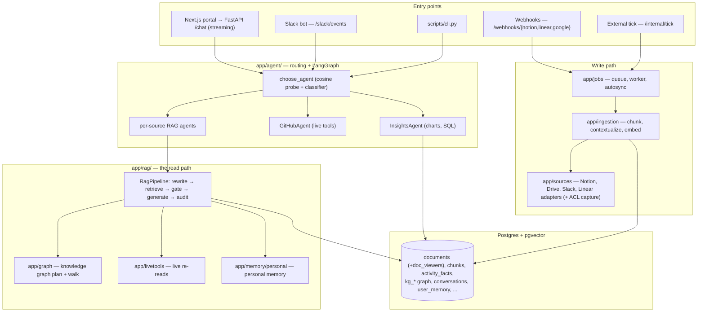
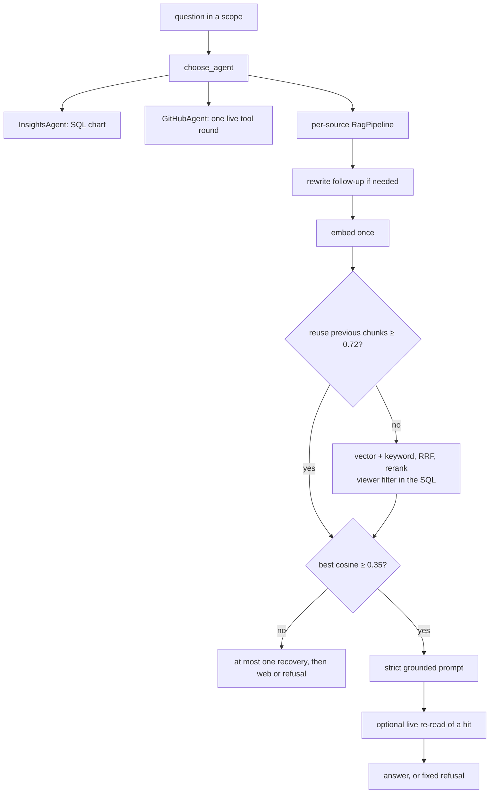

# ARCHITECTURE.md — Complete Technical Reference

> **Purpose of this file.** A single, end-to-end description of what this project
> is, how every component works, and how data flows through it — enough for a
> human or an AI agent to gain full context without reading the whole codebase
> first. It complements two sibling docs:
> - **CLAUDE.md** — the *decision log* (why each choice was made, phase by phase, plus gotchas).
> - **README.md** — the *user-facing quickstart* per phase.
>
> This file is the *system reference*. When code and this file disagree, the code wins — keep this updated.
> **Product status (what is live, tested, blocked, in progress): [PRODUCT_STATUS.md](PRODUCT_STATUS.md).**
> *Last updated: 1 October 2026.* §5–§6 and §8–§11 describe the core write and read paths,
> which are unchanged in shape; later capabilities are summarised in §7 and §15.

---

## 1. What this system is

A **multi-tenant Retrieval-Augmented Generation (RAG) platform for company Q&A over connected tools.**

- **Tenants (organizations)** connect **Notion, Google Drive, Slack, Linear and GitHub** (GitHub is read live, never indexed).
- Their **employees ask natural-language questions** — on the web or in Slack — and get answers **grounded in that organization's own content**, with sources, limited to what each person may open in the source tool.
- **Strict tenant isolation:** one organization can never see another's content.
- **Eventual goal:** a **self-hosted Docker image** an enterprise runs inside its own infrastructure — so the design favors components that run **locally, free, with no external paid dependency** (local embeddings, local reranker, keyless web search, a swappable LLM endpoint).

**Why RAG, not fine-tuning:** policies are *facts that change* (leave rules, reimbursement limits). RAG retrieves the current document text at question time, so updating a policy is just re-ingesting a file — no retraining, and answers cite sources.

---

## 2. Core design principles

1. **Everything is a swappable interface + factory.** Each capability has `base.py` (abstract contract) + one or more concrete impls + `factory.py` (`build_*()` reads config, returns the impl). The rest of the app depends on the *interface*, never a concrete class.
2. **Orchestrators have no `base.py`.** A package that only *composes* existing interfaces (e.g. `app/rag/`, `app/ingestion/`) skips the abstract contract — there's nothing to swap. It still keeps `pipeline.py` + `factory.py` for consistency. Exception: `app/agent/` *does* get a `base.py` because it has many backends (one agent per source, GitHub, Insights).
3. **Config lives in exactly one place.** `app/config/settings.py` — frozen dataclasses with `from_env()`. Nothing else calls `os.getenv` for config.
4. **All failures raise `ProviderError`** (or a subclass in `app/core/exceptions.py`), carrying the original via `cause=` / `raise ... from`.
5. **Tenant isolation is enforced by the query, not the index.** Every tenant-scoped read/write requires an `org_id`; retrieval filters `WHERE org_id = …` *before* ranking.
6. **Grounding is enforced by two independent layers** (a cheap confidence gate + a strict prompt), never one.
7. **Dependency-light.** Thin official SDKs over frameworks (plain `openai` client not LiteLLM; `notion-client` not `llama-index`). Presentation-only deps (`rich`) are confined to `scripts/` and never imported by `app/`.

---

## 3. Tech stack

| Concern | Choice | Notes |
|---|---|---|
| Language | Python 3.11+ | `from __future__ import annotations`, type hints throughout |
| LLM | Any **OpenAI-compatible** endpoint via the `openai` client | `LLM_ADAPTER` picks a provider from a fixed list and supplies its base URL; `LLM_MODEL` is only a parameter. `custom` is the one case that reads `LLM_BASE_URL`. Checked at boot. |
| Model choice | OpenRouter and Groq, per request | Members pick a model; `auto` stays on the deployment's `LLM_MODEL`. Admins can save one bring-your-own preset (14 providers, fixed hosts). |
| Embeddings | **BGE-M3** (1024-dim) | `local` (sentence-transformers) or `remote` behind the same interface. Deploy images use the remote backend when RAM is tight. |
| Vector DB | **Postgres + pgvector** | HNSW cosine index; connection pooling. Also holds jobs, graph, facts, memory. |
| Reranker | **`BAAI/bge-reranker-v2-m3`** | Local cross-encoder, or a remote backend. Default candidate pool is **16**, then `RAG_TOP_K` (5). |
| Sources | Notion, Google Drive, Slack, Linear (indexed); GitHub (live, never embedded); Google Forms (sentiment labels only) | One `SourceAdapter` per indexed source. GitHub and Forms are not adapters. |
| Access | Document sharing captured at sync | Drive per file, Slack per private channel, Linear per private team, GitHub per private repo. Notion is per space. One SQL predicate (`security/visibility.py`). |
| Web search | **DuckDuckGo** via `ddgs` (keyless) | Tavily is the documented production swap |
| Files | Cloudinary | Chat uploads: original bytes and extracted text, private authenticated assets |
| Email | SendGrid in production | `EMAIL_SENDER=console` prints links locally and is not a production sender |
| Safety | Prompt policy, scrubber, link provenance, canary, safeguard model | `app/security/`, `app/guard/` |
| Frontend | Next.js 15, plain CSS | Session only in the httpOnly cookie |
| Tests/eval | `pytest` + optional **RAGAS** (`[eval]` extra) | |

---

## 4. High-level architecture


```mermaid
flowchart TB
    subgraph Edges["Entry points"]
        WEB["Next.js portal → FastAPI /chat (streaming)"]
        SLK["Slack bot — /slack/events"]
        HOOK["Webhooks — /webhooks/{notion,linear,google}"]
        TICK["External tick — /internal/tick"]
        CLI["scripts/cli.py"]
    end

    subgraph Agents["app/agent/ — routing + LangGraph"]
        ROUTE["choose_agent (cosine probe + classifier)"]
        SRCA["per-source RAG agents"]
        GHA["GitHubAgent (live tools)"]
        INS["InsightsAgent (charts, SQL)"]
    end

    subgraph RAG["app/rag/ — the read path"]
        PIPE["RagPipeline: rewrite → retrieve → gate → generate → audit"]
        GRAPH["app/graph — knowledge graph plan + walk"]
        LIVE["app/livetools — live re-reads"]
        PMEM["app/memory/personal — personal memory"]
    end

    subgraph Write["Write path"]
        JOBS["app/jobs — queue, worker, autosync"]
        IPIPE["app/ingestion — chunk, contextualize, embed"]
        SRC["app/sources — Notion, Drive, Slack, Linear adapters (+ ACL capture)"]
    end

    subgraph Data["Postgres + pgvector"]
        DB[("documents (+doc_viewers), chunks, activity_facts,\nkg_* graph, conversations, user_memory, ...")]
    end

    WEB & SLK & CLI --> ROUTE --> SRCA & GHA & INS
    SRCA --> PIPE --> GRAPH & LIVE & PMEM
    PIPE --> DB
    INS --> DB
    HOOK & TICK --> JOBS --> IPIPE --> SRC
    IPIPE --> DB
```

There are **two end-to-end flows**: the **write path** (ingestion) and the **read path** (query). Everything else is a capability those two paths compose.

---

## 5. END-TO-END FLOW A — Ingestion (the write path)

**Entrypoints:** the Sources page (OAuth connect, then folder or channel scope), webhooks (`app/api/webhooks.py`, Slack events), and the external tick (`POST /internal/tick`). `scripts/ingest_notion.py` remains a one-off CLI. The worker is `app/jobs/`.

**Orchestrator:** `app/ingestion/pipeline.py`, always for one explicit `provider`. A Google sync must not delete Notion documents.

1. **Credential.** The live token comes from the org's `oauth_connections` row (encrypted). A per-org Notion token never falls back to another org's. `needs_reauth` rows are not retried.
2. **When it runs.** The first ingest is queued on connect (Drive and Slack wait until a folder or channel list is saved). After that, a webhook flags the connection and a sync starts unless one ran in the last 3 minutes; an hourly poll is the floor for anything a push missed. `last_sync_at` is stamped on attempt.
3. **List, then fetch what changed.** `list_documents()` is also where sharing is captured (`DocAccess` on the ref). Unchanged documents are not re-fetched. A listing that looks like it deleted most of the corpus is refused.
4. **For each changed document:** the adapter renders plain text; text is chunked at **256 tokens / 40 overlap** with a **4,000-character** ceiling; chunks are embedded (1024-dim) and stored with `org_id` and, when set, `workspace_id`. A short context line may be prepended at ingest. Empty documents are skipped.
5. **Access is stored on the row**, not inferred later: `doc_is_public` and `doc_viewers`. An ACL-capable provider that cannot read sharing indexes the document for the connected account only. An already-indexed document whose sharing goes unreadable keeps its last viewer list.
6. **After a successful job:** activity facts for charts, knowledge-graph capture, and a clear of that org's answer cache. GitHub does not ingest; its charts come from a separate live facts sync.

Contextual retrieval spends LLM calls, so background work leaves headroom for live questions (`app/llm/pacing.py`). `INGEST_CONTEXTUAL_ENABLED=false` stores bare chunks.

---

## 6. END-TO-END FLOW B — Query (the read path)

**Entrypoints:** `POST` chat (web), the Slack bot, and `scripts/cli.py`.
**Router:** `app/agent/routing.py::choose_agent`, then a LangGraph node. The corpus (cosine over each connected tool) picks a document agent. A chart question goes to `InsightsAgent` (SQL). A code question, when GitHub is connected, goes to `GitHubAgent` (live tools, nothing embedded). `PolicyAgent` is a legacy fallback, not the product path.

`org_id` comes from the signed session. A space id is paired with it. The asker's email (and prior emails) becomes the `Viewer` that retrieval filters on.

### 6.1 Sequence


```mermaid
flowchart TD
    Q["question in a scope"] --> ROUTE["choose_agent"]
    ROUTE --> CHART["InsightsAgent: SQL chart"]
    ROUTE --> GH["GitHubAgent: one live tool round"]
    ROUTE --> RAG["per-source RagPipeline"]
    RAG --> RW["rewrite follow-up if needed"]
    RW --> EMB["embed once"]
    EMB --> REUSE{"reuse previous chunks ≥ 0.72?"}
    REUSE -- yes --> GATE
    REUSE -- no --> RETRIEVE["vector + keyword, RRF, rerank\nviewer filter in the SQL"]
    RETRIEVE --> GATE{"best cosine ≥ 0.35?"}
    GATE -- no --> REC["at most one recovery, then web or refusal"]
    GATE -- yes --> GEN["strict grounded prompt"]
    GEN --> LIVE["optional live re-read of a hit"]
    LIVE --> ANS["answer, or fixed refusal"]
```

### 6.2 Steps that always hold

1. **Rewrite** only when the chat has history. A first question can also be rewritten from a personal-memory *context* fact (office, team). Preferences never rewrite the search.
2. **Reuse** at cosine **0.72** skips retrieval and still passes the gate.
3. **Retrieval** is hybrid: vector plus keyword, fused with RRF (k=60), reranked from a pool of **16** (`RETRIEVAL_CANDIDATE_POOL`) down to `RAG_TOP_K` (5). The gate reads the **best cosine**, never an RRF score or a reranker logit. The viewer predicate is in the same `WHERE` as `org_id`, before ranking.
4. **Gate at 0.35.** Below it, at most one recovery expansion, then one labelled web search for a real external entity, then the fixed refusal. A document the asker cannot see can replace "I don't know" with an access notice that names the connector, never the title.
5. **Generation** uses three modes only: explicitly supported, related but not explicit, or no supporting evidence. Outside text is fenced. Links in the answer must have appeared in that text.
6. **Live read**, when enabled, refreshes at most two hits after the gate, for a question the classifier marks as about current state. A deleted or forbidden item is withheld.
7. **A graph plan** can add a second tool's documents to the same answer. It reuses the walk; it does not start a second agent.
8. **The conversation is personal** (`conversations.user_id`). Turns, a running summary, and last-retrieval chunks are stored for the next turn. An ungrounded answer is logged as a documentation gap.

GitHub answers are composed only from tool output (README, commit, commits, pull requests, reviews, branches). No tool call, a bad argument, or a failure returns the fixed fallback. Private repositories are readable only when the asker's linked GitHub login can open them.

Charts never let the model emit a number. `InsightsAgent` runs a whitelisted metric from `app/insights/registry.py` (12 metrics across Notion, Drive, GitHub, Linear, Slack, and Forms sentiment).

---

## 7. Component reference (`app/`)

| Package | Contract (`base.py`) | Concrete impl(s) | Responsibility |
|---|---|---|---|
| `config/` | — | `settings.py` | Typed frozen dataclasses w/ `from_env()`. **Only** place reading env for config. |
| `core/` | — | `exceptions.py` | `ProviderError` hierarchy (`LLMProviderError`, `EmbeddingError`, `ConfigurationError`, `SourceError`, `WebSearchError`, `DatabaseError`). |
| `llm/` | `LLMProvider` | `OpenAICompatProvider` | `generate(prompt)` and optional `generate_with_tools(messages, tools, tool_choice)` (function-calling; `NotImplementedError` by default). |
| `embeddings/` | `EmbeddingProvider` | `local.py` (sentence-transformers), `remote.py` (HTTP) | `embed(list[str]) -> list[list[float]]`. BGE-M3, 1024-dim, L2-normalized. |
| `db/` | — | `connection.py`, `schema.sql`, `migrate.py` | Pooled psycopg connections (`register_vector` in the pool's `configure` hook). `apply_schema()` uses a **direct** connection (migration must not use the pool). `close_pool()` at every process exit. |
| `vectorstore/` | `VectorStore` | `PgVectorStore` | `create_organization`, `add_document`, `query` (vector), `keyword_search` (optional), `list_organizations` (optional). All tenant-scoped reads require `org_id`. |
| `ingestion/` | — (orchestrator) | `pipeline.py`, `preprocessing.py`, `chunking.py`, `contextualize.py` | The write path (§5). |
| `rag/` | — (orchestrator) | `pipeline.py`, `retrieval.py`, `prompts.py`, `factory.py` | The read path (§6). |
| `reranker/` | `Reranker` | `local.py` (CrossEncoder) | `rerank(query, candidates, top_k)`. `bge-reranker-v2-m3` (~2.2 GB first download, then cached). |
| `memory/` | `ConversationStore` | `pg_store.py`, `personal.py` | Conversation history, running summary, last retrieval, and personal facts (`user_memory`). |
| `websearch/` | `WebSearchProvider` | `duckduckgo.py` | `search(query, max_results, timeout) -> list[SearchResult]`. |
| `agent/` | `Agent` (+ `AgentResponse`, `Citation`) | per-source agents, `github_agent.py`, `insights_agent.py`, `policy_agent.py` (legacy) | One pinned agent per source; `routing.choose_agent` picks one; LangGraph runs it. |
| `sources/` | `SourceAdapter` | `notion.py`, `google_drive.py`, `slack.py`, `linear.py`; `google_groups.py`, `google_forms.py`, `drive_watch.py` | Indexed adapters capture sharing on the listing. Groups expand on read. Forms are labels only. Drive push channels. |
| `githublive/` | `GitHubReader` | `rest.py`, `access.py` | GitHub read live; `access.restrict` narrows to repos the asker's linked login can open. |
| `security/` | — | `visibility.py`, `untrusted.py`, `links.py`, `outbound.py`, `agents.md` | The one document-access predicate; untrusted-text policy, scrubbing, link provenance. |
| `guard/` | `InjectionGuard` | `prompt_guard.py`, `safeguard.py`, `moderation.py` | Prompt-injection scoring at ingest, answer moderation. |
| `graph/` | — | `identities`, `builder`, `walk`, `plan` | Second Brain knowledge graph. |
| `livetools/` | — | `gateway.py` + per-provider readers | Second Brain live connector reads. |
| `insights/` | — | `registry`, `facts`, `store`, `resolve`, `pins` | Charts from SQL over `activity_facts`. |
| `attachments/` | — | `extract`, `limits`, `store`, `blobstore` | Chat uploads; bytes + extracted text in Cloudinary. |
| `feedback/` | — | `store.py` | Answer ratings and documentation gaps. |
| `schedulers/` | — | `store`, `activity`, `runner`, `worker` | Scheduled reports, emailed via `auth/email.py` (SendGrid in prod). |
| `jobs/` | — | `queue`, `worker`, `autosync` | Durable ingestion queue; interval + push-triggered sync. |
| `auth/` | `OAuthProvider` | per-connector OAuth, `magic_link`, `session`, `email`, `email_change` | Sign-in, connector auth, email delivery, email change. |
| `api/` | — | FastAPI routers incl. `slack_events.py`, `webhooks.py` | The only place `org_id` enters a request (from the session). |

**Other top-level:**
- `evaluation/` — golden-set eval (deterministic path-firing tier + RAGAS tier). Peer to `scripts/`/`tests/`.
- `scripts/` — entrypoints: `cli.py`, `ingest_notion.py`, `verify_providers.py`, `init_db.py`, `demo_rag.py`, `compare_retrieval.py`, `demo_phase8.py`.
- `tests/` — pytest suite (isolation, grounding, conversation, websearch, retrieval, golden-set path-firing, incremental summary, reuse, recovery, CLI, notion credentials).

---

## 8. Database schema (`app/db/schema.sql`)

The full column list lives in `schema.sql` and in CLAUDE.md §6. The groups that matter:

| Group | Tables |
|---|---|
| Tenant | `organizations`, `users`, `user_email_aliases`, `workspaces`, `workspace_members` |
| Sign-in | `magic_link_tokens`, `oauth_states`, `email_change_requests`, `org_signup_requests` |
| Connectors | `oauth_connections` (encrypted tokens, `source_config`), `drive_watch_channels`, `github_install_pending` |
| Corpus | `documents` (`doc_is_public`, `doc_viewers`, `source_meta`), `chunks` (`vector(1024)`, generated `content_tsv`, injection score) |
| Ask | `conversations` (personal: `user_id`), `conversation_turns`, `conversation_last_retrieval`, `conversation_attachments` (metadata only), `query_answer_cache`, `user_memory` |
| Charts & graph | `activity_facts`, `insight_pins`, `kg_entities`, `kg_edges`, `kg_evidence`, `person_identities` |
| Ops | `ingestion_jobs`, `schedulers`, `scheduler_reports`, `feedback_and_gaps`, `live_tool_calls`, `api_rate_counters` |

`chunks.embedding` is `vector(1024)` to match BGE-M3. Changing the model means changing `EMBEDDING_DIM` and re-ingesting. Deletes cascade from `organizations` and `workspaces`. A workspace id is nullable: `NULL` means org-wide, and a space query never also returns org-wide rows.

---

## 9. Multi-tenancy & isolation (the central invariant)

Four boundaries, all in the query or in a check that runs before it:

1. **Company.** Every tenant table has `org_id`. Retrieval filters `WHERE org_id = …` before ranking (`tests/test_isolation.py`). The id comes from the session cookie in `app/api/deps.py`, never from the client.
2. **Space.** `workspace_id` is always paired with `org_id`. A space sees only its own rows.
3. **Document.** `security/visibility.py` is the one spelling of "public in this scope, or shared with this person". It runs on vector search, keyword search, recent chunks, charts, starter chips, and the graph walk. People match by email, including a prior sign-in email.
4. **Person.** Chats, reports, pins, memory, and attachments are keyed by `(org_id, user_id)`. Holding someone else's conversation id does not open their chat.

What the connector token can reach (a Drive folder, a Slack channel list, GitHub's granted repos, pages shared with the Notion integration) is a separate limit from who inside the company may read a row.

---

## 10. Grounding & anti-hallucination (two layers)

Neither layer alone is trusted. A similarity threshold cannot cleanly separate "answerable" from "on-topic but unanswered" on a small sample (CLAUDE.md §5).

1. **Confidence gate (cheap, pre-LLM).** `RAG_SIMILARITY_THRESHOLD` = **0.35** (just above noise ~0.30). Below it → fallback with **no LLM call**. Catches irrelevant-context noise cheaply.
2. **Strict prompt (fine-grained).** `prompts.py` forbids outside knowledge and orders the model to emit the *exact* fallback string when the context doesn't directly answer — even if on-topic. Handles the "related-but-doesn't-answer" case the threshold can't.

The **fixed fallback string** lives in ONE place (`RagSettings.fallback_response`) and is consumed in three that must agree: the gate, the prompt's refusal instruction, and `_is_refusal()` detection.

---

## 11. Conversation memory, incremental summarization & retrieval reuse

- **Verbatim window:** the most recent `MEMORY_RECENT_TURNS` (=3) turns are kept in full.
- **Incremental summarization (Phase 8):** after *every* turn, the single turn that just left the window is folded into the running summary via one LLM call over `existing summary + that one turn`. Cost is small and ~constant regardless of conversation length. (Replaced Phase 5's bulk-at-threshold approach; `MEMORY_SUMMARIZE_AFTER` was removed.) Best-effort: on LLM error the fold is skipped and retried next turn.
- **Retrieval reuse (Phase 8):** the deterministic non-LLM cosine check described in §6.2 step 3. Threshold **0.72**, deliberately conservative because on this corpus cosine cannot cleanly separate "same fact" (≈0.63) from "adjacent topic" (≈0.67); a wrong reuse produces a wrong "I don't know" while a missed reuse only costs one retrieval. Chunk **text** (not embeddings) is stored and re-embedded on demand.

---

## 12. Configuration reference (env vars)

All read in `app/config/settings.py`. The annotated list is `.env.example`. Defaults in parentheses are the code defaults; production turns several features on by environment (see PRODUCT_STATUS.md).

| Group | Vars |
|---|---|
| **LLM** | `LLM_ADAPTER`, `LLM_MODEL`, `LLM_API_KEY`. `LLM_BASE_URL` only for `custom`. Boot check: `LLM_CONFIG_CHECK`. |
| **Model choice** | OpenRouter and Groq keys. Bring-your-own is stored per org, not an env model string. |
| **Embeddings / rerank** | `EMBEDDING_BACKEND` (local), `RERANKER_BACKEND`, `RETRIEVAL_CANDIDATE_POOL` (16), `RETRIEVAL_RRF_K` (60), `RAG_TOP_K` (5) |
| **Database** | `DATABASE_URL`, `EMBEDDING_DIM` (1024) |
| **Chunking** | `CHUNK_SIZE` (256), `CHUNK_OVERLAP` (40), `CHUNK_MAX_CHARS` (4000), `CHUNK_TOKEN_BACKEND` (heuristic) |
| **RAG** | `RAG_SIMILARITY_THRESHOLD` (0.35), `RETRIEVAL_REUSE_THRESHOLD` (0.72) |
| **Second Brain** | `GRAPH_RETRIEVAL_ENABLED` (false), `LIVE_TOOLS_ENABLED` (false), `LIVE_TOOLS_PROVIDERS` (linear), `PERSONAL_MEMORY_ENABLED` (false) |
| **Safety** | `GUARD_MODE` (off), `RAG_AUDIT_ENABLED` (false) |
| **Email** | `EMAIL_SENDER` (`console` in code; `sendgrid` in production) |
| **Freshness** | `INTERNAL_TICK_SECRET`; webhook secrets for Slack, Linear, Notion; `DRIVE_PUSH_BASE_URL` |
| **Files** | Cloudinary cloud, key, and folder — both set, or neither |

---

## 13. How to run

```bash
python -m venv .venv && source .venv/bin/activate
pip install -r requirements.txt
cp .env.example .env          # LLM key and the rest; never commit .env
docker compose up -d          # Postgres + pgvector
python scripts/init_db.py
uvicorn app.api.main:app --reload
cd frontend && npm install && npm run dev
```

Organizations connect Notion, Drive, Slack, Linear, and GitHub from the Sources page. Syncing then runs on its own. `python scripts/cli.py` is the terminal client. Tests:

```bash
pytest -m "not network and not live_llm"
```

---

## 14. Extension points

- **Swap the LLM:** set `LLM_ADAPTER` to a name in `app/llm/adapters.py`. Do not invent a base URL that fights the adapter.
- **Add an indexed source:** a `SourceAdapter` plus a factory branch, and a decision about how that source's sharing is captured. GitHub is the pattern for a source that must not be embedded.
- **Add an agent:** `Agent.answer()` → `AgentResponse`, registered with routing. A misroute must cost a refusal, not an answer from the wrong corpus.
- **Swap embeddings, reranker, or web search:** a new impl behind the existing `base.py` and factory. An embedding-width change is a schema change and a re-ingest.

---

## 15. Phase history (what was built when)

| Phase | Delivered |
|---|---|
| 1 | LLM + embedding provider abstractions, config, core exceptions |
| 2 | Postgres/pgvector schema behind a pooled connection layer, preprocessing + chunking, `VectorStore`. Multi-tenant isolation test |
| 3 | RAG query path: embed → org-scoped retrieve → confidence gate → strict grounded prompt → answer. Two-layer anti-hallucination |
| 4 | First external source: Notion (`SourceAdapter` + `NotionAdapter`), `ingest_source` pipeline |
| 5 | (A) Conversation memory (query rewrite + running summary); (B) Web-search fallback (tool-calling, labelled, graceful degradation) |
| 6 | Better retrieval under the unchanged gate: contextual retrieval (ingest), hybrid vector+keyword RRF, cross-encoder reranking |
| 7 | (A) Formal `PolicyAgent` behind `Agent`; (B) Golden-set evaluation (path-firing tier + RAGAS tier) wired into CI |
| 8 | (A) Incremental summarization; (B) retrieval reuse (deterministic non-LLM cosine check) + `conversation_last_retrieval` table |
| 9 | (A) Single interactive `rich` CLI over `PolicyAgent` (retired `ask.py`/`chat.py`); (B) per-organization Notion credentials (`NOTION_TOKEN_<NAME>`, `resolve_token`, no fallback) + `list_organizations` |
| 10+ | HTTP API + Next.js portal, magic-link auth, OAuth per connector, signup approval, ingestion queue; Drive, Slack, Linear adapters; GitHub live reads; spaces; per-source routing; Ask in Slack; scheduled reports; multi-model + BYOM; automatic sync; charts in Ask; attachments in Cloudinary; feedback and gaps; needs-attention bell; prompt-injection defense; Second Brain (graph, live reads, personal memory); document-level access control; push sync (PR #44, 2026-10-01). See `PRODUCT_STATUS.md` and `CLAUDE.md` §3. |

---

## 16. Known limitations, gotchas & open issues

**Gotchas (see CLAUDE.md §5 for the full list):**
- Migration must **not** use the connection pool (the pool's `configure` runs `register_vector`, which needs the `vector` extension to already exist).
- Contextual retrieval changes stored `content` (chunk = `"<context>\n\n<original>"`), so displayed chunks include the prefix, and stored size exceeds the raw source.
- The reranker downloads ~2.2 GB on first use, then caches.
- Notion tokens are per-org and must **not** fall back; a page must be **explicitly shared** with the integration or `list_documents()` returns zero pages.
- The Phase 3 grounding test fixture disables memory + web search for determinism.
- Reuse fires rarely on a small corpus by design (0.72 threshold).

**Resolved since first written:** retrieval recall on typo'd queries (query normalization,
`app/rag/query_normalize.py`, plus hybrid search) and over-inference on ambiguous text (the
three-mode grounded prompt, §6.2 step 6).

---

## 17. Not built yet

See `PRODUCT_STATUS.md` §11–§12 for the current list. In short: Notion per-page access
(no provider API), Google Groups in production (needs a Workspace-admin connection), more
connectors (Confluence, Jira, Zendesk, Salesforce, SharePoint), structural citations + NLI,
Postgres RLS, the self-hosted Docker image, and open-ended charts (PR #45, in review).
